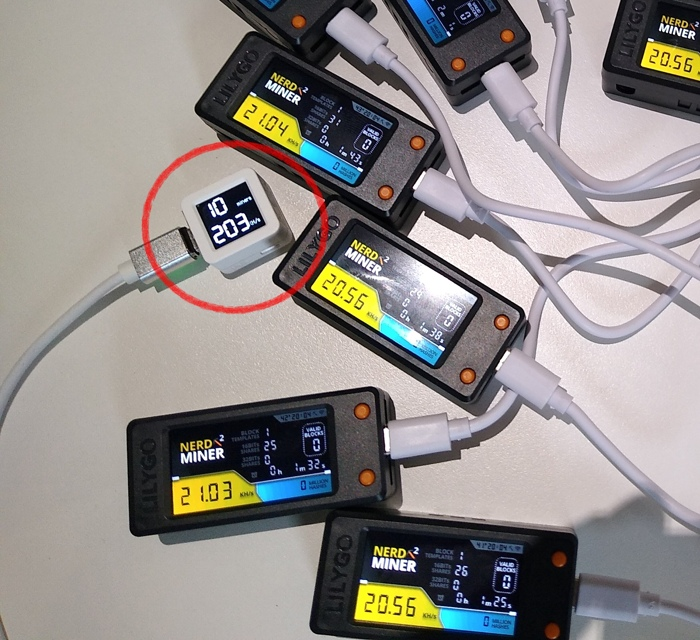

# PlatformIO M5Stack

 Shows the total miners and total hashrate from all your [NerdMiners](https://github.com/BitMaker-hub/NerdMiner_v2) of your local network



## Specs

I used an ESP32-S3 AtomS3 board from M5Stack,  if you have other M5Stack board you can compile for it with only changing platform.io file  ( uncomment your board )

It's very easy to adapt the main code for other boards ( esp32, esp8266, ... )


## How it works ?

Nerd-monitor receives UDP packets from each NerdMiner so you must clone NerdMiner repo and change this to allow each NerdMiner send UDP packets to your monitor


**Change mining.cpp**

Add this to the top 

```cpp
// Broadcast Hashrate to nerdminer-monitor
#include <AsyncUDP.h>
AsyncUDP udp;
```

and this just before //Total hashes comment (about line 615)

```cpp
    //- NerdMiner-Monitor ----------------->
    String ret = "HR=";
    ret.concat( tmp );
    udp.broadcastTo(ret.c_str(), 9876);
    // <-----------------------------------
```
